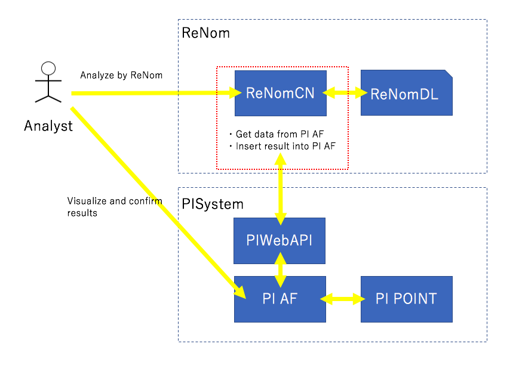

# ReNomCN

ReNomCN is the interface of ReNom to various databases.

# Connect to PI System
## Overview
PI System is a suite of software products such as database that are used for data collection as electric power collected by various resources.

It can be used for analytics, visualization and shareing.

Outline diagram of this system is shown below.

## Install

## Setup PISystem Environment
If you want to use PI System interface, setup PIsystem environment following bellow url.

https://pisquare.osisoft.com/community/all-things-pi/japanese/japanpidevelopersclubkaihatsu

Also, you need below settings.

- Create a new attributtion for prediction data which can be inserted future data.
- Set PI Web API Server to accept HTTP POST request.
- Set Basic authentication to PI Web API Server.
 
For more detail, see below url.

## Install from source
For installing ReNomCN, download the repository from following url.

`git clone https://gitlab.com/grid-devs/ReNomCN.git`

Move into ReNomCN directory.
`cd ReNomCN`

Then install all required packages.

`python setup.py install`
