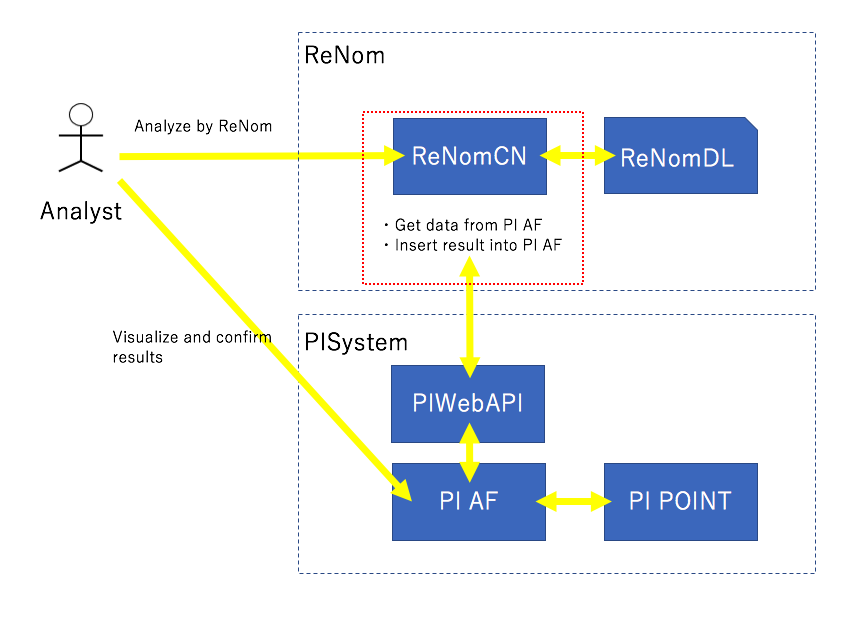

ReNomCN
========

ReNomCN is the interface of ReNom to various databases.
Current version(0.0.1) provides an data interface between PI system.

**OSI soft- PIsystem** : https://www.osisoft.jp/pi-system/

Overview
========
Connect to PI System
--------------------

PI System is a suite of software products such as database that are used for data collection as electric power collected by various resources.

It can be used for analytics, visualization and shareing.

ReNomCN provides an interface between ReNomDL and PIsystem.
Outline diagram of this system is shown below.

Install
========

Setup PISystem Environment
--------------------------

If you want to use PI System interface, setup PIsystem environment following url.

https://pisquare.osisoft.com/community/all-things-pi/japanese/japanpidevelopersclubkaihatsu

Also, you need some settings.

- Create a new attributtion for prediction data which can be inserted future data.
- Set PI Web API Server to accept HTTP POST request.
- Set Basic authentication to PI Web API Server.
 
For more detail, see below url.

Install from source
===================

For installing ReNomCN, download this repository using following command.

.. code-block:: shell

    git clone https://gitlab.com/grid-devs/ReNomCN.git

Then move into ReNomCN directory.

.. code-block:: shell

    cd ReNomCN

And install using following command.

.. code-block:: shell

    python setup.py install
